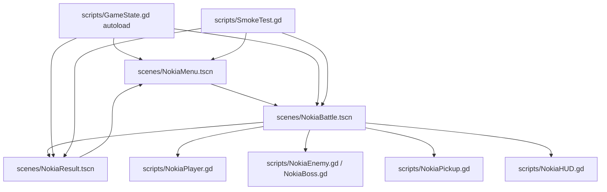

# Space War II

Godot 4 vertical shooter prototype inspired by the compact, fast-loop mobile shooter era. The project focuses on a playable single-player route with auto fire, pickups, stage pressure, boss encounters, and a concise result screen.

简体中文文档：[README.zh-CN.md](README.zh-CN.md)


## Contents

- [What It Is](#what-it-is)
- [Features](#features)
- [Architecture](#architecture)
- [Quick Start](#quick-start)
- [Controls](#controls)
- [Project Structure](#project-structure)
- [Verification](#verification)
- [Web Export](#web-export)
- [Showcase Screenshots](#showcase-screenshots)
- [Roadmap](#roadmap)
- [Security](#security)
- [License](#license)

## What It Is

Space War II is a small Godot game prototype built around a simple arcade loop:

1. Start from the menu.
2. Enter a vertical scrolling battle.
3. Move, auto-fire, dodge enemies, and collect pickups.
4. Clear stage pressure and boss encounters.
5. Review score, route progress, pickups, and distance on the result screen.

The current project is intentionally compact. It is useful as a reference for a Godot shooter prototype, a BIAU Playlab case study source project, or a base for further arcade-system experiments.

## Features

- Godot 4.6.1 project with `NokiaMenu` as the main scene.
- Vertical shooter battle loop with movement, auto fire, bombs, pickups, lives, HP, score, and route progress.
- Three-stage route structure with boss encounters.
- Multiple enemy pressure patterns, including scout, tank, sweeper, diver, and boss variants.
- Compact HUD and result screen.
- `GameState` autoload for run state shared by menu, battle, and result scenes.
- Headless smoke test script for basic flow verification.
- Screenshot capture helper for Playlab/public showcase assets.

## Architecture



The project keeps game flow, player behavior, enemy behavior, HUD, result summary, and run state in separate scripts. New gameplay work should extend these boundaries instead of moving everything into one scene script.

## Quick Start

Prerequisites:

- Godot 4.6.1 or a compatible Godot 4.x version.
- Git.

Clone the repository and open it with Godot:

```bash
git clone <repo-url>
cd "spacewar II"
godot --path .
```

If your Godot executable is not on `PATH`, replace `godot` with your local executable path.

## Controls

| Action | Input |
| --- | --- |
| Move | `WASD` or Arrow Keys |
| Fire | `Space` |
| Bomb | `X` |

## Project Structure

```text
.
├── assets/
│   └── fonts/
├── data/
├── docs/
├── scenes/
├── scripts/
├── tools/
├── ui/
├── AGENTS.md
├── project.godot
└── README.md
```

Key files:

| File | Purpose |
| --- | --- |
| `project.godot` | Godot project settings and `GameState` autoload registration. |
| `scenes/NokiaMenu.tscn` | Main menu and game entry. |
| `scenes/NokiaBattle.tscn` | Primary battle scene. |
| `scenes/NokiaResult.tscn` | Result summary scene. |
| `scripts/GameState.gd` | Shared run state. |
| `scripts/NokiaBattle.gd` | Stage progression, spawning, boss flow, scoring, and battle orchestration. |
| `scripts/NokiaPlayer.gd` | Player movement, damage, fire, and bombs. |
| `scripts/NokiaEnemy.gd` | Enemy behavior variants. |
| `scripts/NokiaBoss.gd` | Boss behavior. |
| `scripts/NokiaHUD.gd` | Battle HUD updates. |
| `scripts/SmokeTest.gd` | Headless smoke path. |
| `tools/capture_site_screens.gd` | Deterministic screenshot capture helper. |

## Verification

Open the project in Godot for visual testing, or run the smoke test from the command line:

```bash
godot --headless --path . -s res://scripts/SmokeTest.gd
```

The smoke script checks the basic route:

- menu scene loads;
- battle scene starts;
- scripted battle progress completes;
- result scene is reached.

For a lighter project-load check:

```bash
godot --headless --path . --quit
```

## Web Export

This repository does not commit a personal `export_presets.cfg` path. Create or update a Web export preset in Godot, then export to a local build directory:

```bash
mkdir -p build/web
godot --headless --path . --export-release Web build/web/index.html
```

For BIAU Playlab, the exported Web build can be copied or uploaded into the Playlab playable hosting pipeline under the `spacewar-ii` slug. Keep generated Web export files out of the source repository unless they are intentionally published as release artifacts.

## Showcase Screenshots

The screenshot helper can capture menu, battle, and result images for a public showcase.

Default output goes to Godot's `user://spacewar-ii-screenshots` directory:

```bash
godot --path . --script res://tools/capture_site_screens.gd
```

Override the output directory with an environment variable:

```bash
SPACEWAR_II_SCREENSHOT_DIR=./build/screenshots godot --path . --script res://tools/capture_site_screens.gd
```

Or pass a user argument:

```bash
godot --path . --script res://tools/capture_site_screens.gd -- --output-dir=./build/screenshots
```

## Roadmap

- Tune boss pacing and route pressure after broader playtesting.
- Add more stage visual differentiation.
- Improve audio and hit feedback.
- Add a release checklist for Web builds used by the Playlab showcase.
- Decide whether to keep this as a compact prototype or evolve it into a fuller mobile-style shooter.

## Security

- Do not commit local export paths, private hosting tokens, signing material, or generated release artifacts.
- Keep Playlab/R2 upload credentials outside this repository.
- Treat exported Web builds as release artifacts that need their own review before public hosting.

## License

This repository is licensed under the [Apache License 2.0](LICENSE).
