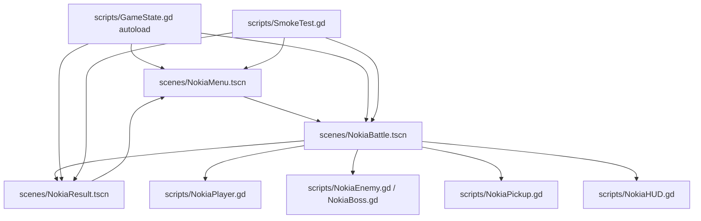

# Space War II

中文文档 | [English README](README.md)

Space War II 是一个 Godot 4 纵版射击原型，参考经典移动端射击游戏时代的紧凑节奏。项目重点是一个可玩的单人路线：自动射击、道具、阶段压力、Boss 遭遇和简洁结算页。

## 功能

- Godot 4.6.1 项目，主场景为 `NokiaMenu`。
- 纵版射击战斗闭环：移动、自动射击、炸弹、拾取、生命、HP、分数和路线进度。
- 三阶段路线结构和 Boss 遭遇。
- 多种敌人压力模式：scout、tank、sweeper、diver 和 boss。
- 紧凑 HUD 与结算页。
- `GameState` autoload 在菜单、战斗和结算之间共享局内状态。
- Headless smoke test 用于基础流程验证。
- 可配置输出目录的截图脚本，用于公开展示素材。

## 架构



项目保持流程、玩家、敌人、HUD、结算和运行状态的职责分离。后续玩法扩展应沿用这些边界，不要把逻辑堆进单个场景脚本。

## 快速开始

要求：

- Godot 4.6.1 或兼容 Godot 4.x
- Git

```bash
git clone <repo-url>
cd "spacewar II"
godot --path .
```

如果 `godot` 不在 `PATH` 中，请替换为本机 Godot 可执行文件路径。

## 操作

| 动作 | 输入 |
| --- | --- |
| 移动 | `WASD` 或方向键 |
| 射击 | `Space` |
| 炸弹 | `X` |

## 验证

```bash
godot --headless --path . -s res://scripts/SmokeTest.gd
```

Smoke test 检查：

- 菜单场景加载；
- 战斗场景启动；
- 脚本化战斗流程完成；
- 进入结算页。

轻量项目加载检查：

```bash
godot --headless --path . --quit
```

## Web 导出

仓库不提交个人本机导出路径。请在 Godot 中创建或更新 Web export preset，然后导出到本地构建目录：

```bash
mkdir -p build/web
godot --headless --path . --export-release Web build/web/index.html
```

用于 BIAU Playlab 时，可以把导出的 Web 构建复制或上传到 `spacewar-ii` slug 对应的 playable hosting pipeline。生成的 Web export 文件默认不进入源码仓库。

## 展示截图

默认输出到 Godot 的 `user://spacewar-ii-screenshots`：

```bash
godot --path . --script res://tools/capture_site_screens.gd
```

通过环境变量指定输出目录：

```bash
SPACEWAR_II_SCREENSHOT_DIR=./build/screenshots godot --path . --script res://tools/capture_site_screens.gd
```

通过命令参数指定输出目录：

```bash
godot --path . --script res://tools/capture_site_screens.gd -- --output-dir=./build/screenshots
```

## 安全边界

- 不提交本机导出路径、私有托管 token、签名材料或生成的发布产物。
- Playlab/R2 上传凭据必须留在仓库外。
- Web 导出产物作为发布 artifact，需要单独复核后再公开托管。

## 许可证

当前仓库使用 [Apache License 2.0](LICENSE) 许可证。
